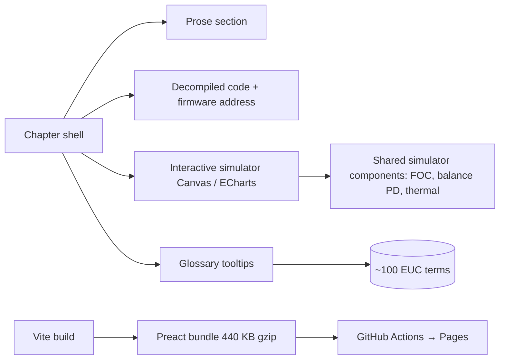
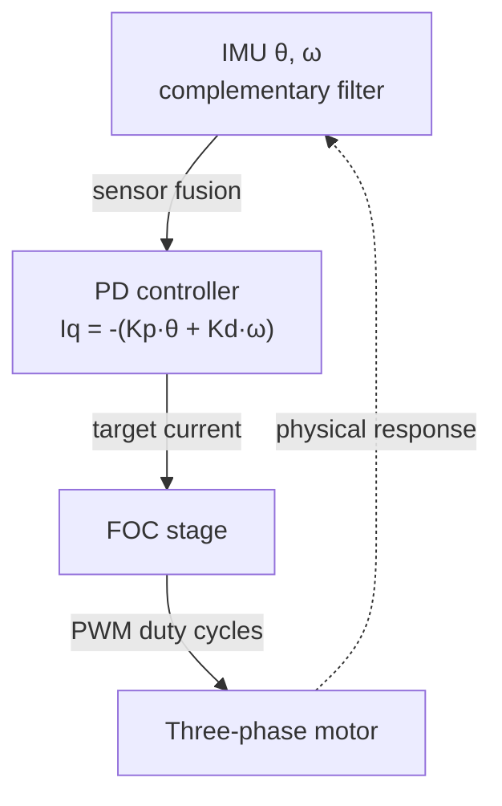
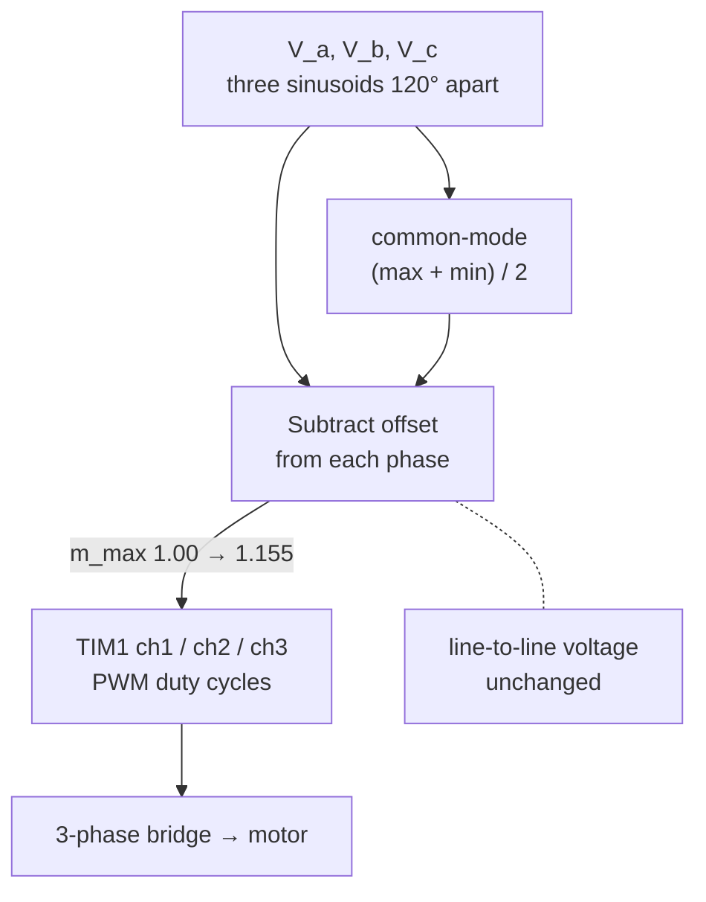
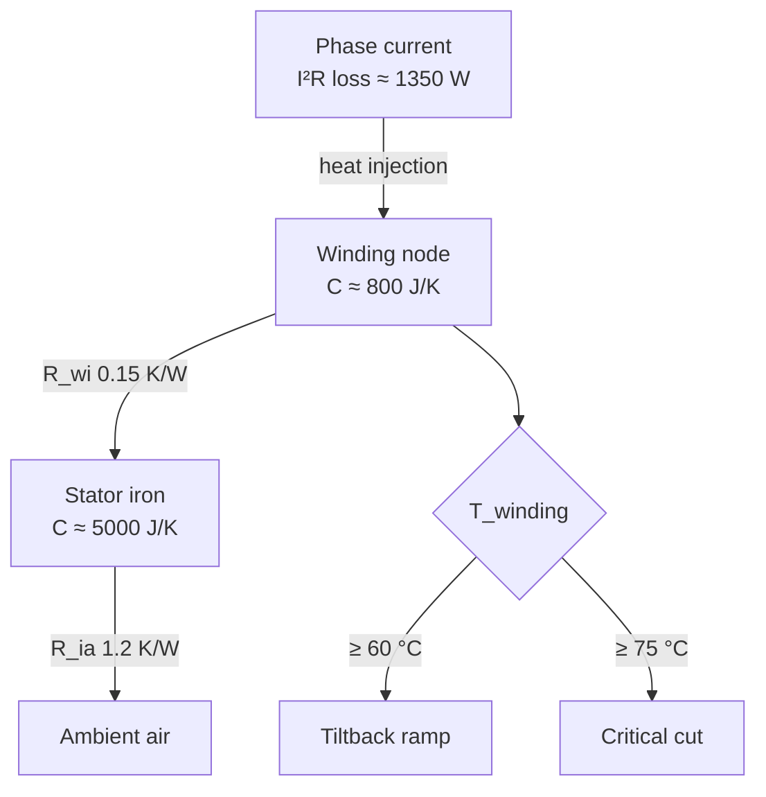

## Problem

A self-balancing electric unicycle rides because dozens of algorithms run inside it: a PD balance loop reading an IMU, FOC controlling a brushless motor, field weakening past base speed, a thermal model protecting the windings. None of this is documented for the public — the only available "documentation" is the decompiled firmware. Riders treat the wheel as a black box and the math as inaccessible.

I wanted to show those algorithms alive, not as textbook formulas. Each one running in a simulator that you can poke from a browser, paired with the actual decompiled code that runs on the wheel.

## Approach

Reverse-engineered the **Begode ET Max** firmware (STM32F405, 168 V FOC) from scratch in **Ghidra**. Each algorithmic concept gets a chapter, and each chapter pairs four things:

1. A prose explanation in plain language
2. Decompiled code with **real firmware addresses** so you can verify it against the binary
3. An **interactive simulator** on Canvas 2D or ECharts — drag a slider, watch the algorithm behave
4. A glossary of the technical terms used, with hover tooltips

14 chapters cover the stack from hardware (STM32 timers, ADC, motor windings) up through sensors (MPU6500 IMU, complementary filter), the boot sequence and state machine, the 50-µs FOC interrupt, the balance PD loop, the FOC math (Clarke/Park transforms, flux observer), field weakening, the thermal model, and the BLE telemetry protocol.

## Architecture

Preact instead of React keeps the bundle small (~1.35 MB total, 440 KB gzipped). Simulator components are reusable — the FOC simulator from chapter 8 also drives the field-weakening visualisation in chapter 10. No backend, deployed automatically through GitHub Actions on push to `main`.

## Highlights

Three chapters that show different layers of the stack — control, math, and physics.

### Balance · the PD loop that keeps the wheel up

After IMU fusion, every 50 µs the firmware reads the lean angle θ and angular velocity ω and computes a target current for the torque-producing winding: `Iq_target = -(Kp·θ + Kd·ω)`. No integral term — the gravity load is symmetric around vertical, so steady-state error stays zero. The simulator lets you drag Kp and Kd; below 80 Kp the wheel falls, above 400 it oscillates with pedal buzz.

[Play chapter VII →](https://thelonius.github.io/euc-anthology/?lang=en#balance)

### The Flux · SVPWM and 15 % of headroom for free

After the inverse transforms (d/q → α/β → A/B/C) the FOC stage has three reference voltages it wants on the windings. Drive them as plain sinusoids and the usable bus voltage caps out at V_bus/2 per phase — modulation index m = 1.00. SVPWM subtracts the common-mode component `(max + min) / 2` from every phase before PWM. Because the same offset comes off all three, the **line-to-line voltage** — the only thing the motor actually feels — is unchanged. But the three signals now fit into the ±V_bus/2 band with slack, raising the usable m to 2/√3 ≈ 1.155. That's ~15 % extra torque from the same battery, no hardware change. The firmware does the saturation clipping in `Control_SVPWM_Modulation_Limit` at `0x00014C00` with an inverse-square-root lookup.

[Play chapter VIII →](https://thelonius.github.io/euc-anthology/?lang=en#foc)

### Heat · the thermal model that bites back

I²R losses dump roughly 1,350 W of waste heat into the windings at 100 A phase current. With no active cooling, only thermal mass and conductivity stop the motor from melting. The firmware models two nodes — winding (~800 J/K, fast) and stator iron (~5,000 J/K, slow) — with thermal resistance R_wi ≈ 0.15 K/W between them and R_ia ≈ 1.2 K/W to ambient. At 60 °C the tiltback ramp starts; at 75 °C the wheel cuts torque. The simulator lets you crank the current and watch the curve.

[Play chapter XII →](https://thelonius.github.io/euc-anthology/?lang=en#thermal)

