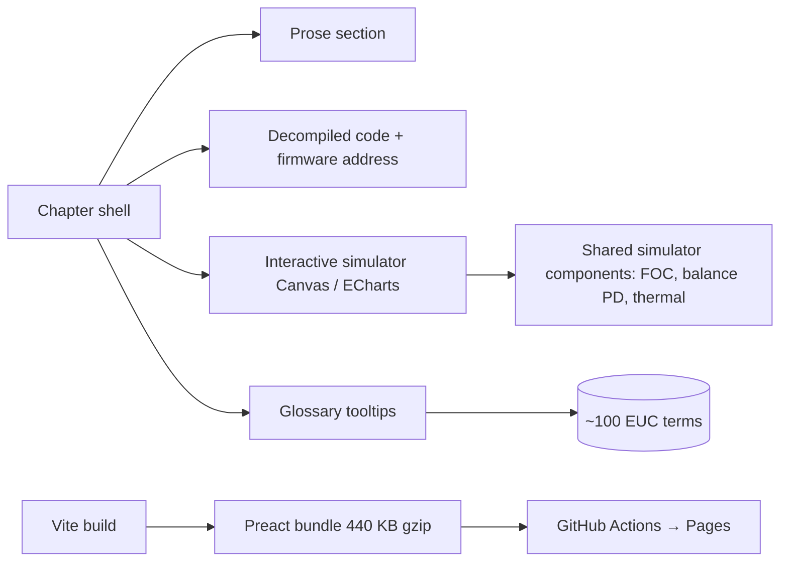

## Problem

A self-balancing electric unicycle rides because dozens of algorithms run inside it: a PD balance loop reading an IMU, FOC controlling a brushless motor, field weakening past base speed, a thermal model protecting the windings. None of this is documented for the public — the only available "documentation" is the decompiled firmware. Riders treat the wheel as a black box and the math as inaccessible.

I wanted to show those algorithms alive, not as textbook formulas. Each one running in a simulator that you can poke from a browser, paired with the actual decompiled code that runs on the wheel.

## Approach

Reverse-engineered the **Begode ET Max** firmware (STM32F405, 168 V FOC) from scratch in **Ghidra**. Each algorithmic concept gets a chapter, and each chapter pairs four things:

1. A prose explanation in plain language
2. Decompiled code with **real firmware addresses** so you can verify it against the binary
3. An **interactive simulator** on Canvas 2D or ECharts — drag a slider, watch the algorithm behave
4. A glossary of the technical terms used, with hover tooltips

14 chapters cover the stack from hardware (STM32 timers, ADC, motor windings) up through sensors (MPU6500 IMU, complementary filter), the boot sequence and state machine, the 50-µs FOC interrupt, the balance PD loop, the FOC math (Clarke/Park transforms, flux observer), field weakening, the thermal model, and the BLE telemetry protocol.

## Architecture

Preact instead of React keeps the bundle small (~1.35 MB total, 440 KB gzipped). Simulator components are reusable — the FOC simulator from chapter 8 also drives the field-weakening visualisation in chapter 10. No backend, deployed automatically through GitHub Actions on push to `main`.

