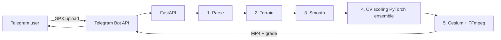

## Problem

GPS tracks recorded by mainstream apps (Strava, Komoot) are useful for the user who recorded them but boring to share — flat maps with a coloured line. To turn a workout into something worth watching, the track needs to become a cinematic flythrough with terrain context, and the system has to reject bad tracks (sparse points, GPS jitter, broken altitude) before spending render budget on them.

The goal: take a GPX file, score it for renderability, and produce a shareable 3D video — all triggered from a Telegram message.

## Approach

A **5-stage async FastAPI pipeline** with explicit memory monitoring at each stage so a 200 KB GPX never balloons into a 4 GB Cesium scene mid-render.

1. **Parse GPX** — extract points, validate timestamps and altitudes
2. **Terrain query** — fetch tile data from Cesium Ion for the bounding box
3. **Smoothing & interpolation** — median filter on jitter, spline-fit the path
4. **CV quality scoring** — PyTorch ensemble of 15+ models: MiDaS depth estimation on terrain rendering, Structure-from-Motion to validate trajectory plausibility, classification heads for "is this a real run?", regression heads for confidence
5. **Render** — Cesium scene + FFmpeg encode to MP4, push back to Telegram with a quality grade

The Telegram Mini App is the user interface: upload GPX, see your video, share. No app store, no install, no auth flow.

## Architecture

Each stage is a separate async task with its own timeout and memory budget. If stage 4 rejects the track (low quality grade), we skip rendering and respond with the diagnostic — saving compute and giving the user actionable feedback.

