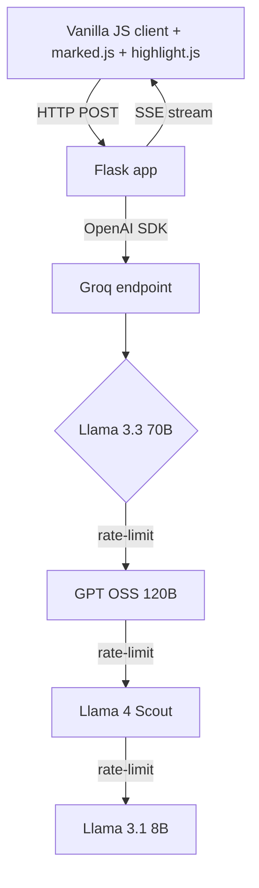

## Problem

Preparing for a Senior MLOps interview means covering 12 broad topics — Kubernetes operators, Triton Inference Server, ClearML pipelines, model monitoring, system design — and the existing prep materials are either too shallow (blog posts) or too expensive (paid courses).

I wanted a tool I could open from a phone on a commute, hit any topic, and switch between three learning modes — read, drill, simulate — without paying a subscription.

## Approach

Flask backend with **Server-Sent Events** for token-by-token streamed responses. Front is plain JavaScript (no React), `marked.js` for Markdown rendering, `highlight.js` for code blocks.

The model layer is a **multi-model fallback chain** through Groq's OpenAI-compatible endpoint: primary is Llama 3.3 70B, with automatic failover to GPT OSS 120B → Llama 4 Scout → Llama 3.1 8B when the primary rate-limits. The user sees uninterrupted streaming; the back logs which model answered.

Every code block in any answer gets an "explain this code" action — the tutor walks through it line by line in a child SSE stream. Per-topic progress lives in `localStorage`; `sessionStorage` keeps parallel tabs independent so two topics can run side-by-side.

## Architecture

The fallback chain is configured declaratively in one Python list — adding a new model is one line. SSE handles back-pressure naturally: if the client disconnects, the upstream stream is cancelled.

