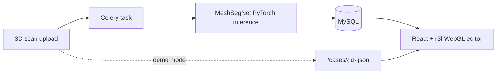

## Problem

A planning technician spends 30-60 minutes per case on jaw segmentation and target-position setup — most of it is rote work: per-tooth labelling, copying geometry into an editor, repeating the same wrist motions across hundreds of cases.

The clinical decision is the technician's, but the surrounding mechanical work is the bottleneck. Goal: shrink that loop with ML and an interactive UI without taking the final placement out of the technician's hands.

## Approach

Pre-computed segmentation runs on **MeshSegNet** (PyTorch), served asynchronously via Celery so the UI never blocks on inference. The segmented jaw is loaded into the front as FBX/OBJ. Each tooth is a separate mesh tagged with FDI numbering.

The technician edits target positions on the maximum stage with a Three.js TransformControls gizmo — drag, rotate, fine-tune. Aligner stages between initial and target positions interpolate automatically. The technician sees the full motion sequence as a slider, not a one-shot result.

In demo mode (GitHub Pages), the front reads pre-segmented JSON cases directly. In dev mode, the full FastAPI + Celery + Redis + MySQL stack runs through Docker Compose, so a real scan upload triggers a real inference run.

## Architecture

The split between dev (full stack) and demo (static JSON) means the GitHub Pages deployment runs with zero backend — fast, free, and survives any traffic spike. The architecture is symmetrical: same React front talks to either a live API or pre-baked JSON.

