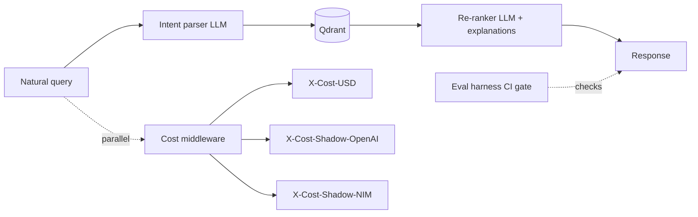

## Problem

Real-estate search is built on rigid filters: room count, price range, district. A query like "family with kids and a dog, quiet neighbourhood" has nowhere to land. The user has to translate intent into filters and the system loses everything that doesn't fit a numeric box.

I wanted a demo where lifestyle queries actually work over a real dataset — and where the cost story is honest, not "just pipe it through OpenAI". Three providers compared side by side on the same workload.

## Approach

FastAPI + Qdrant + a **multi-provider LLM abstraction** with one client interface. Switching from OpenAI to Anthropic to NVIDIA NIM to local Ollama is a single env-flag change. The same query path runs against any of them.

The query goes through three steps: an intent parser (LLM) extracts lifestyle constraints from the natural-language query; Qdrant runs the vector search with hybrid filters; a re-ranker (LLM) produces the final ordering with per-listing explanations.

A **cost middleware** runs in parallel: every response carries `X-Cost-USD` for the real call, plus shadow-cost headers (`X-Cost-Shadow-OpenAI-USD`, `X-Cost-Shadow-NIM-USD`) for the providers that would have been used. The founder sees the actual bill and the counterfactual — useful when defending a provider choice in a review.

An **evaluation harness** runs as a CI gate. Precision@K, recall@K, MRR, mean latency, mean cost — all reported per gold query in a diff-friendly Markdown report. A pull request that worsens precision shows the regression next to the code.

## Architecture

The provider client is one Python protocol; switching providers is a one-line config change. Vector dimensions are pinned per Qdrant collection, so the embedding-provider routing is sticky to collection — switching the chat provider doesn't accidentally break vector compatibility.

