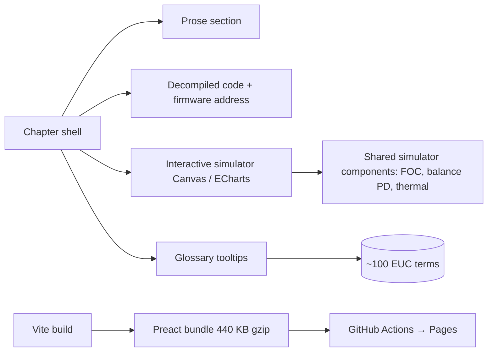

## Задача

Самобалансирующееся электрическое моноколесо едет потому, что внутри работают десятки алгоритмов: PD-контур баланса читает IMU, FOC управляет бесколлекторным мотором, ослабление поля работает выше базовой скорости, тепловая модель защищает обмотки. Ничего из этого не задокументировано публично — единственная доступная «документация» — это декомпилированная прошивка. Райдеры воспринимают колесо как чёрный ящик, а математику — как недоступную.

Я хотел показать эти алгоритмы живыми, а не учебными формулами. Каждый работает в симуляторе, который можно потрогать из браузера, рядом с реальным декомпилированным кодом, который крутится на колесе.

## Решение

Прошивка **Begode ET Max** (STM32F405, FOC на 168 В) реверс-инжинирилась с нуля в **Ghidra**. Каждая алгоритмическая концепция получает главу, и каждая глава соединяет четыре вещи:

1. Объяснение прозой простым языком
2. Декомпилированный код с **реальными адресами прошивки** — можно сверить с бинарником
3. **Интерактивный симулятор** на Canvas 2D или ECharts — двигаешь ползунок, смотришь, как ведёт себя алгоритм
4. Глоссарий технических терминов со всплывающими подсказками

14 глав покрывают стек от железа (таймеры STM32, ADC, обмотки мотора) через датчики (IMU MPU6500, комплементарный фильтр), последовательность загрузки и конечный автомат, FOC-прерывание на 50 мкс, PD-контур баланса, математику FOC (преобразования Кларка/Парка, наблюдатель потокосцепления), ослабление поля, тепловую модель и протокол BLE-телеметрии.

## Архитектура

Preact вместо React держит бандл небольшим (~1.35 МБ всего, 440 КБ в gzip). Компоненты симуляторов переиспользуются — FOC-симулятор из главы 8 также крутит визуализацию ослабления поля в главе 10. Бэкенда нет, деплой автоматический через GitHub Actions по пушу в `main`.
