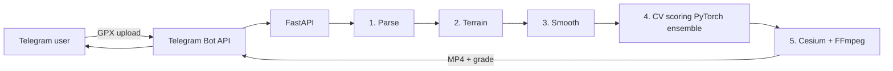

## Задача

GPS-треки, записанные обычными приложениями (Strava, Komoot), полезны тому, кто их записал, но скучны для шеринга — плоская карта с цветной линией. Чтобы тренировка стала чем-то, что хочется смотреть, трек надо превратить в кинематографичный пролёт с контекстом рельефа, а система должна отбраковывать плохие треки (разрежённые точки, GPS-джиттер, битая высота) до того, как потратит на них бюджет рендера.

Цель: взять GPX-файл, оценить его пригодность к рендеру и выдать 3D-видео для шеринга — всё по одному сообщению в Telegram.

## Решение

**Асинхронный конвейер FastAPI из 5 стадий** с явным мониторингом памяти на каждой стадии, чтобы GPX на 200 КБ не раздулся в сцену Cesium на 4 ГБ посреди рендера.

1. **Разбор GPX** — извлечь точки, проверить таймстемпы и высоты
2. **Запрос рельефа** — забрать данные тайлов из Cesium Ion для bounding box
3. **Сглаживание и интерполяция** — медианный фильтр по джиттеру, сплайн-аппроксимация пути
4. **CV-оценка качества** — ансамбль PyTorch из 15+ моделей: оценка глубины MiDaS по рендеру рельефа, Structure-from-Motion для проверки правдоподобности траектории, головы классификации «реальная ли это пробежка?», головы регрессии для уверенности
5. **Рендер** — сцена Cesium + кодирование в MP4 через FFmpeg, отправка обратно в Telegram с оценкой качества

Telegram Mini App — это пользовательский интерфейс: загрузил GPX, посмотрел видео, поделился. Без магазина приложений, без установки, без авторизации.

## Архитектура

Каждая стадия — отдельная асинхронная задача со своим таймаутом и бюджетом памяти. Если стадия 4 отбраковывает трек (низкая оценка качества), мы пропускаем рендер и отвечаем диагностикой — экономим вычисления и даём пользователю конкретную обратную связь.
