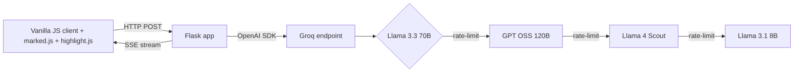

## Задача

Подготовка к собеседованию Senior MLOps означает покрыть 12 широких тем — операторы Kubernetes, Triton Inference Server, пайплайны ClearML, мониторинг моделей, system design — а готовые материалы либо слишком поверхностные (статьи в блогах), либо слишком дорогие (платные курсы).

Я хотел инструмент, который открываю с телефона в дороге, выбираю любую тему и переключаюсь между тремя режимами обучения — читать, прорешивать, симулировать — без подписки.

## Решение

Бэкенд на Flask с **Server-Sent Events** для ответов, стримящихся по токенам. Фронт — чистый JavaScript (без React), `marked.js` для рендера Markdown, `highlight.js` для блоков кода.

Слой моделей — это **цепочка фолбэка по нескольким моделям** через OpenAI-совместимый эндпоинт Groq: основная — Llama 3.3 70B, с автоматическим переключением на GPT OSS 120B → Llama 4 Scout → Llama 3.1 8B, когда основная упирается в rate-limit. Пользователь видит непрерывный стриминг; бэкенд логирует, какая модель ответила.

У каждого блока кода в любом ответе есть действие «объясни этот код» — тьютор разбирает его построчно в дочернем SSE-стриме. Прогресс по темам живёт в `localStorage`; `sessionStorage` держит параллельные вкладки независимыми, так что две темы можно вести бок о бок.

## Архитектура

Цепочка фолбэка задаётся декларативно одним списком Python — добавить новую модель — это одна строка. SSE естественно справляется с back-pressure: если клиент отключился, апстрим-стрим отменяется.
