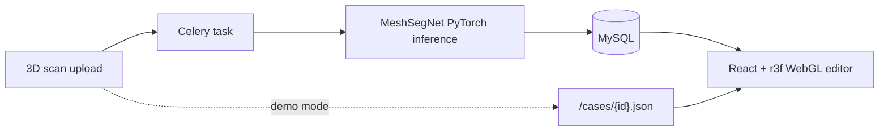

## Задача

Техник-планировщик тратит 30-60 минут на кейс — сегментация челюсти и расстановка целевых позиций, и большая часть этого — рутина: по-зубная разметка, перенос геометрии в редактор, повтор одних и тех же движений запястьем на сотнях кейсов.

Клиническое решение принимает техник, но окружающая механическая работа — узкое место. Цель: сократить этот цикл с помощью ML и интерактивного UI, не вынимая финальную расстановку из рук техника.

## Решение

Предрасчёт сегментации идёт на **MeshSegNet** (PyTorch), отдаётся асинхронно через Celery, так что UI никогда не блокируется на инференсе. Сегментированная челюсть грузится во фронт как FBX/OBJ. Каждый зуб — отдельный меш с тегом по нумерации FDI.

Техник правит целевые позиции на максимальной стадии гизмо TransformControls из Three.js — тянет, вращает, доводит. Стадии элайнера между начальной и целевой позициями интерполируются автоматически. Техник видит всю последовательность движения как ползунок, а не разовый результат.

В демо-режиме (GitHub Pages) фронт читает заранее сегментированные JSON-кейсы напрямую. В dev-режиме полный стек FastAPI + Celery + Redis + MySQL крутится через Docker Compose, так что загрузка реального скана запускает реальный инференс.

## Архитектура

Разделение на dev (полный стек) и demo (статический JSON) означает, что деплой на GitHub Pages работает с нулевым бэкендом — быстро, бесплатно и переживает любой всплеск трафика. Архитектура симметрична: один и тот же React-фронт говорит либо с живым API, либо с заранее запечённым JSON.
